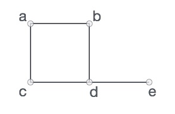

# Read : 35

## Graphs

- A graph is a pictorial representation of a set of objects where some pairs of objects are connected by links. 

- The interconnected objects are represented by points termed as vertices, and the links that connect the vertices are called edges. 

- **Basic operations performed by graphs:**
    - Display graph vertices.
    - Display graph edges.
    - Add a vertex.
    - Add an edge.
    - Creating a graph.

- A graph can be easily presented using the python **dictionary** data types. 

- We represent the **vertices** as the `keys` of the dictionary and the connection between the vertices also called **edges** as the `values` in the dictionary.




```
V = {a, b, c, d, e}
E = {ab, ac, bd, cd, de} 
```
```
# Create the dictionary with graph elements
graph = { "a" : ["b","c"],
          "b" : ["a", "d"],
          "c" : ["a", "d"],
          "d" : ["e"],
          "e" : ["d"]
         }
# Print the graph 		 
print(graph)
```

- **Display graph vertices:**

```
class graph:
    def __init__(self,gdict=None):
        if gdict is None:
            gdict = []
        self.gdict = gdict
# Get the keys of the dictionary
    def getVertices(self):
        return list(self.gdict.keys())
# Create the dictionary with graph elements
graph_elements = { "a" : ["b","c"],
                "b" : ["a", "d"],
                "c" : ["a", "d"],
                "d" : ["e"],
                "e" : ["d"]
                }
g = graph(graph_elements)
print(g.getVertices())
```
- **Display graph edges:**

```
class graph:
    def __init__(self,gdict=None):
        if gdict is None:
            gdict = {}
        self.gdict = gdict
    def edges(self):
        return self.findedges()
# Find the distinct list of edges
    def findedges(self):
        edgename = []
        for vrtx in self.gdict:
            for nxtvrtx in self.gdict[vrtx]:
                if {nxtvrtx, vrtx} not in edgename:
                    edgename.append({vrtx, nxtvrtx})
        return edgename
# Create the dictionary with graph elements
graph_elements = { "a" : ["b","c"],
                "b" : ["a", "d"],
                "c" : ["a", "d"],
                "d" : ["e"],
                "e" : ["d"]
                }
g = graph(graph_elements)
print(g.edges())
```
##### [Go Back](code_401_reading_notes.md)